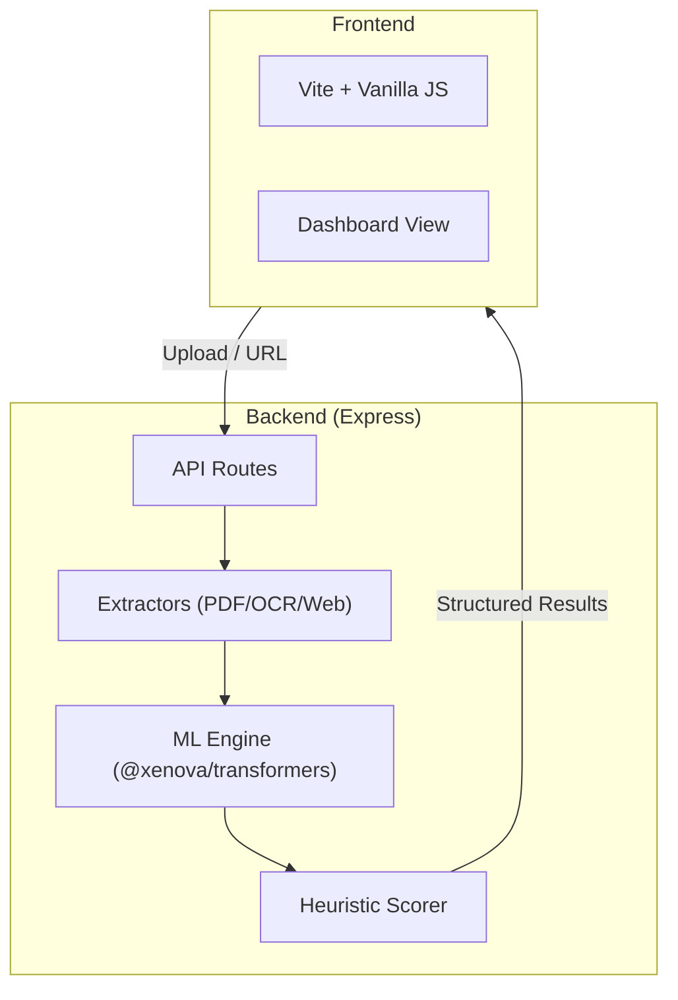

# 📄 Content Analyzer

**A local-first, ML-powered engine for optimizing social media engagement.**

Analyze PDFs, images, or URLs to get concrete, explainable suggestions to boost your content's readability, hook strength, and overall impact.

---

## 🏗️ Architecture



---

## 🔥 Key Features

- **⚡ Local ML Inference**: Runs 100% locally using `@xenova/transformers` (DistilBERT for sentiment, MiniLM for hooks). No API keys required.
- **🌐 URL Extraction**: Extract and analyze content directly from LinkedIn, Twitter, and other complex SPAs.
- **🔍 Smart OCR**: Extract text from PNG/JPG screenshots using Tesseract.js.
- **⚖️ Dimensions of Impact**:
    - **Readability**: Coleman-Liau Grade Level analysis.
    - **Engagement**: Semantic Hook Archetype detection (Bold Claim, Story, Statistic, etc.).
    - **Clarity**: Passive voice and jargon detection.
    - **Actionability**: Imperative directive analysis.
- **🎯 Actionable Steps**: Get 3-6 prioritized suggestions explaining *what* to change, *why* it matters, and *how* to fix it.

---

## 🚀 Quick Start

```bash
# 1. Clone & Install
npm install

# 2. Run in Development Mode
# On first run, ~90MB of models are downloaded to .model_cache/
npm run dev
```

---

## 📂 Project Structure

- `server/analysis/`: The "Brain" — ML logic, hook centroids, and score heuristics.
- `server/extractors/`: Text extraction logic for PDFs, Images, and Web pages.
- `main.js`: Frontend state management and dashboard rendering.
- `style.css`: Modern design system and dashboard layouts.


