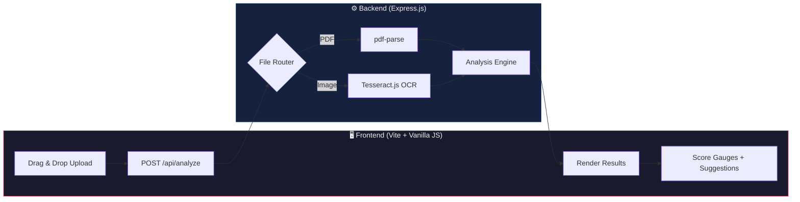
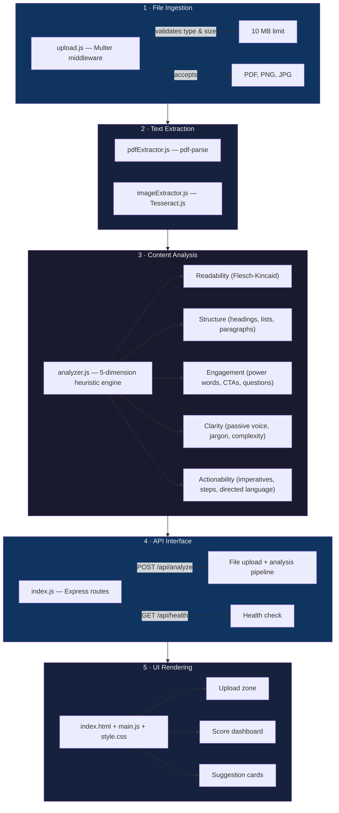

# 🏗️ Content Analyzer — Architecture

## High-Level Data Flow

```
Upload File → Ingest → Extract Text → Analyze Content → Structured Response → Render Results
```



## Module Boundaries

The codebase is split into **5 layers** with clear responsibilities:



## Tech Stack Rationale

| Layer | Tool | Why |
|---|---|---|
| Frontend | Vite + vanilla JS | Zero framework overhead, instant HMR, no build complexity |
| Backend | Express.js | Lightweight, mature, excellent file-handling ecosystem |
| PDF extraction | pdf-parse | Pure JS, no native binaries, handles digital PDFs well |
| Image OCR | Tesseract.js | Runs in Node.js, no external services or API keys |
| Analysis | Custom heuristics | Explainable, fast, deterministic — no black-box AI |

## Directory Structure

```
unthinkable/
├── docs/
│   └── architecture.md        ← you are here
├── server/
│   ├── index.js               ← Express entry point + routes
│   ├── middleware/
│   │   └── upload.js           ← Multer config (type/size validation)
│   ├── extractors/
│   │   ├── pdfExtractor.js     ← pdf-parse wrapper
│   │   └── imageExtractor.js   ← Tesseract.js OCR wrapper
│   └── analysis/
│       └── analyzer.js         ← 5-dimension heuristic engine
├── index.html                  ← Frontend entry
├── style.css                   ← Design system
├── main.js                     ← Client-side logic
├── sample_files/               ← Test files
├── package.json
├── vite.config.js
└── README.md
```
